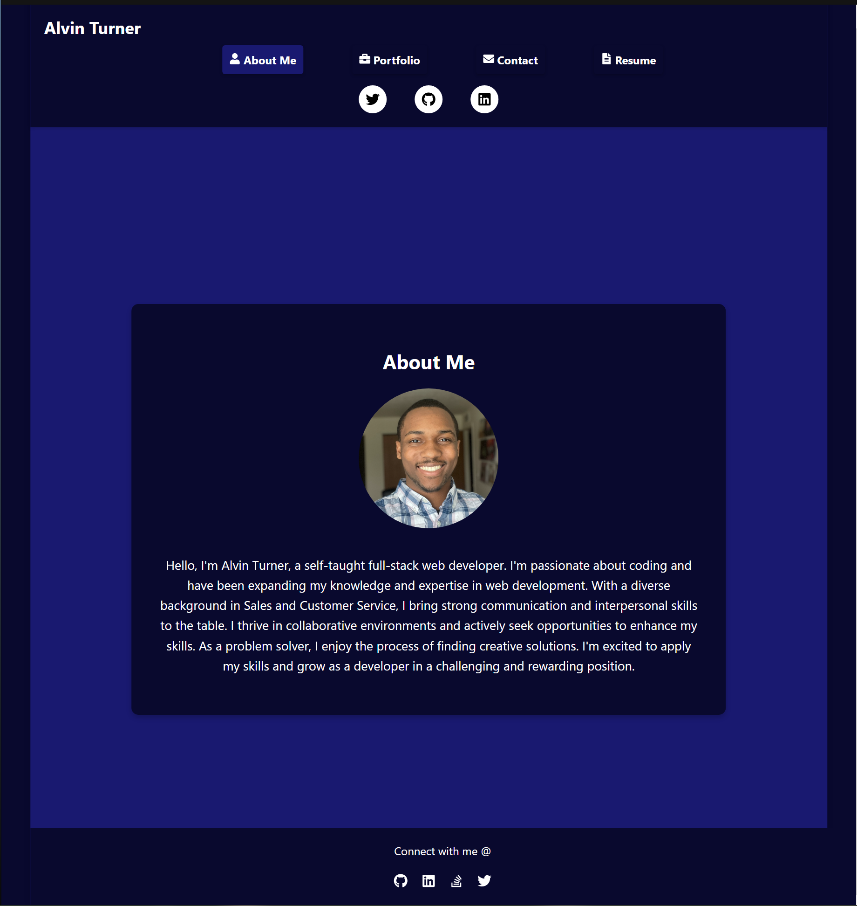

# React Portfolio

This is my personal portfolio built using React. It showcases my projects, skills, and provides a way to get in touch with me. The portfolio is designed to be modern, visually appealing, and responsive.

## Features

- Interactive and user-friendly design
- Showcase of projects with descriptions, screenshots, and links
- Skills section highlighting my proficiencies
- Contact form for easy communication
- Responsive layout for optimal viewing on different devices

## Technologies Used

- React
- HTML5
- CSS3
- Sass
- JavaScript
- Git

## Installation

1. Clone the repository: `git clone https://github.com/your-username/react-portfolio.git`
2. Navigate to the project directory: `cd react-portfolio`
3. Install the dependencies: `npm install`
4. Start the development server: `npm start`
5. Open your browser and visit `http://localhost:3000` to view the portfolio

## Usage

- Customize the portfolio by updating the project information in the data files
- Modify the styles to match your desired design
- Add your own projects and skills to showcase your work and expertise
- Integrate the contact form with a server-side solution to receive contact messages
## License

This project is licensed under the MIT License - see the [LICENSE](LICENSE) file for details.

## Contact
- Email: A.Turner3x@gmail.com
- GitHub: [Your GitHub Profile](https://github.com/ATurner3x)
